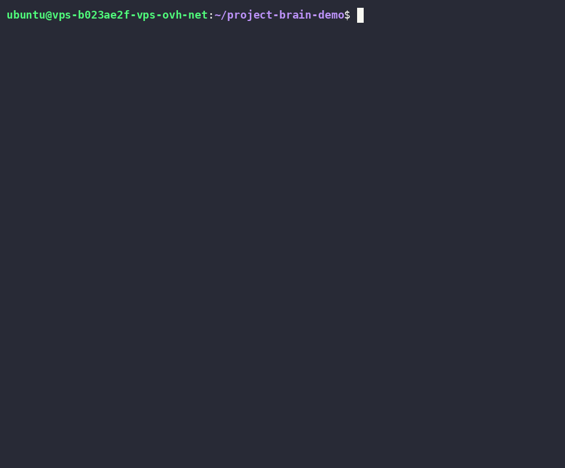

# Project Brain — persistent, navigable memory for AI coding agents

**Stop re-explaining your projects to the AI every session.**

**Works with: Claude Code · Cursor · Windsurf · any file-reading agent.**



<sub>Core recall flow shown above (read the map → recall with version history → refuse to redo verified work). See **[What's new in 2.1](#whats-new-in-21)** for the latest, and **[What's new in 2.0](#whats-new-in-20)** for the compact index, tiers, session resume, decisions, people, and infra-safe export.</sub>

Project Brain gives your AI agent a small, navigable **map** of your projects — their stack, decisions,
pitfalls, what's done, what failed, and where you left off — so it stops forgetting, stops mixing
projects up, and stops re-reading a 1000-line README into context on every task.

It is **not** a database, a server, or another AI wrapper. It's a convention plus a skill: a
`.project-brain/` folder of plain Markdown that any file-reading agent navigates through an index,
loading detail only when it's actually needed. Zero dependencies, plain text, yours to read and commit.

---

## Why Project Brain — what a flat notes file (or an auto-summarizer) won't give you

- **Status carries the outcome.** `✓ verified` vs `✗ failed` vs `⚠ in-progress` — the model knows the
  difference between *"done and works"* and *"we tried that and it broke,"* and won't silently redo it.
- **Provenance — it knows what it doesn't know.** Every note is `trust: human` (a person confirmed it),
  `ai-inferred` (a guess — verify first), or `pref` (your stated preference). A model's guess can't
  harden into "fact" just by being written down.
- **Staleness — memory with an expiry date.** `review_by:` dates flag facts that have aged
  (credentials, versions, "current" anything) instead of serving last year's note as gospel.
- **A cross-project guard + conflict detector.** The multi-project case is where memory rots into
  *wrong* answers — a fact from project A applied to project B. The validator catches misfiled notes
  and flags a project that names two of the same exclusive tech (MySQL **and** Postgres? a stale fact).
- **Index-first, bounded cost.** Only a small index is ever loaded eagerly; detail lives in topic files
  read on demand. A generated **compact** index plus **HOT/WARM/COLD tiers** keep the per-session cost
  bounded even as the brain grows to dozens of projects.
- **Hard rules you can't break.** `! never: deploy outside the EU` — constraints, always in context.
- **Decisions remember *why*.** A decision log keeps rejected alternatives rejected, so the agent stops
  re-proposing the thing you already ruled out.
- **It remembers people too** — what the client agreed, which vendor you're locked into.
- **Resume instantly.** A one-line session summary (done / next / blocker) tells the agent exactly
  where you left off.
- **Portable & inspectable.** Plain Markdown + a zero-dependency Python validator (`brain-check`). Read
  it, edit it, grep it, commit it to your repo, or export it into any chat. No lock-in, no opaque store.

---

## The problem

Every new session, on every project: explain the architecture, the deployment, the stack, the history,
the known pitfalls… again. And after a few hours the model starts mixing details between projects —
this one is FastAPI + Postgres, that one is Node + tRPC + MySQL — and quietly redoing things you
finished last week.

## The fix

```
.project-brain/
  index.md                  # a small MAP: projects → topics → status + pointer  (+ a generated index.compact)
  projects/<project>/<topic>.md   # the detail, read only when needed
  people/<slug>.md                # agreements with humans (client/partner/vendor)
```

The agent reads the **small index** first. Ask *"how did we solve the cache issue?"* and it follows one
pointer to one file — not the whole knowledge base. Ask it to *"swap the logo"* when the map says that
was done and verified three days ago, and it tells you and asks, instead of silently redoing it.

---

## How is this different from native Session Memory / ClaudeMem?

Auto-memory tools (a tool's built-in session memory, ClaudeMem, and similar) summarize your transcripts
for you. That's genuinely zero-effort — and it's a different thing from what Project Brain is for. The
honest trade:

| | Auto session memory / ClaudeMem | **Project Brain** |
|---|---|---|
| How it's built | **Automatic** — summarizes your transcripts (zero effort) | **Curated** — a human chooses what's worth keeping |
| What it is | A running **journal** of what happened | A **map of truth**: status (✓/✗), versions, decisions |
| Trust | Undifferentiated | `human` (FACT) vs `ai-inferred` vs `pref` |
| Freshness | No expiry | `review_by:` + staleness flags |
| Multi-project | Mixes easily | Cross-project guard + conflict detector |
| Reach | Tied to one tool | Plain Markdown — Claude Code, Cursor, Windsurf, any file-reading agent |
| Ownership | Lives inside the tool | A folder you read, edit, grep, and **commit to your repo** |
| Cost over time | Grows with history | Index-first + tiers — eager cost stays **bounded** |
| Inspectable | Opaque | Every byte is yours to open and edit |

They're complementary: auto-memory is a frictionless journal; Project Brain is the deliberate,
inspectable, portable map you actually trust to plan against. If you want a human-curated source of
truth that survives months and travels across tools, that's this.

---

## What's new in 2.1

Quality-of-life release that finishes wiring the brain into Claude Code's own machinery —
backward compatible, still zero runtime dependencies for the brain itself.

- **`install.sh` auto-wires the `brain-nudge` Stop hook for skill installs.** Previously only the
  plugin path registered the save-reminder hook; a skill-only install shipped it but never ran it.
  The installer now **merges** the hook into `~/.claude/settings.json` — it preserves your existing
  keys, is idempotent, and **backs up + prints a diff** before writing (uses `node`, which Claude Code
  already ships, so no `jq` needed).
- **`brain-bootstrap`** — an on-demand tool that points Claude Code's native per-project memory at the
  brain, **non-destructively**: writes a small *conditional* redirect ("if this workspace has a
  `.project-brain/`, it's the source of truth"), backs up and preserves any existing notes, and is
  idempotent. Cuts the always-loaded native-memory tokens without losing anything.
- **`init`-time native→brain seeding** — `/project-brain init` now offers to seed that same redirect for
  the current workspace, so one memory system stops competing with (and drifting from) the brain.

Full details in the [CHANGELOG](CHANGELOG.md).

---

## What's new in 2.0

- **Dual-format index** — a generated, token-cheap `index.compact` the agent reads first (≈ −52% vs
  `index.md` on a real multi-project brain), falling back to `index.md` if it's missing.
- **HOT / WARM / COLD tiers** — the eager cost stays bounded as the brain grows past 15 projects.
- **One-line session resume** — done / next / blocker, so you pick up exactly where you left off.
- **Hard rules** (`! never:`), **`trust: pref`**, and **delta-load** (reload only what changed).
- **Decision log** — why a path was chosen and what was rejected, so it isn't re-proposed.
- **`brain-export`** — one pasteable file for claude.ai / Gemini / ChatGPT, infra redacted by default.
- **`people/`** — first-class memory for agreements with clients, partners, and vendors.
- **`brain-check --report`**, a **conflict detector**, and **`--diff <date>`** (what changed since when).

Full details in the [CHANGELOG](CHANGELOG.md).

---

## What it actually saves

Be honest with yourself about why you'd use this:

- **Fewer tokens — when it applies.** If you keep everything in a giant always-loaded doc, splitting
  into a small index + on-demand topic files genuinely cuts per-session context; the compact and tiers
  cut it further on big brains. If your brain is tiny, the win is modest (and the compact's fixed legend
  can even make it slightly larger — it's built for accumulated content).
- **Fewer hallucinations.** The map is an anchor. The model stops inventing your deployment or swapping
  one project's stack for another's — and the conflict detector catches it when a fact drifts.
- **Multi-month memory.** Come back after three months and the agent still knows how it works — without
  you pasting a kilometre of README.

---

## Install

```bash
git clone https://github.com/OoneBreath/claude-code-project-brain.git
cd claude-code-project-brain
./install.sh        # copies the skill into ~/.claude/skills/  (run on each machine)
```

**Start a new Claude Code session after installing** — skills load at session start.

> `install.sh` also wires the optional `brain-nudge` save-reminder hook by **merging** it into
> `~/.claude/settings.json` — it keeps your existing settings, is idempotent, and backs up + prints a
> diff before writing (a corrupt or foreign settings.json is left untouched).

Then, in a session inside your workspace:

```
/project-brain        →  "init"     set up .project-brain/ and detect your projects
/project-brain        →  "how did we solve X?"   recall through the index
```

Run `init` once **per workspace**. The skill is installed per machine (`~/.claude/skills/`), but the
memory (`.project-brain/`) lives per project — so on a server hosting several repos, point `init` at the
workspace root and it catalogs them all in one brain.

> **First run is light by design.** `init` detects your projects from `package.json` / `pyproject.toml`
> / git and writes a small index — it does **not** read your source. Ask it to "scan the project" for a
> one-time deep backfill that reads your docs/code to pre-fill topics; it summarises what's there, it
> doesn't invent context, so depth varies by how well a repo is documented.

## How it works

- The skill lives in `~/.claude/skills/project-brain/` (personal scope, per machine).
- `index.md` is the hand-edited **source of truth**. `brain-compact` regenerates `index.compact` from it
  — one-way, deterministic, zero tokens (no LLM call). The agent reads the compact first and falls back
  to `index.md` if it's missing or stale, so nothing ever breaks.
- One brain can catalog **many projects on one server** or a single repo. Everything is plain Markdown
  you can read, edit, and commit.
- `brain-check` (`python3 ~/.claude/skills/project-brain/brain-check`) validates the brain — broken
  pointers, malformed frontmatter, index↔topic drift, stale facts, misfiled cross-project notes, tech
  conflicts, people records. `--report` groups it readably; `--diff <date>` shows what changed; `--strict`
  adds stricter cross-project isolation. Zero dependencies, plain Python 3.
- `brain-export` bundles the brain into one pasteable file for another assistant — infra redacted by
  default.
- An optional `brain-nudge` Stop hook fires at the **end of a turn** (throttled, so it nudges once
  after work, not every turn) and reminds you to save when a turn changed files but the brain wasn't
  updated. It only **suggests** — it never writes to the brain.
- **It doesn't bloat over time.** Topic files are cold storage — only the index is loaded eagerly, so the
  per-session cost is bounded by the index (kept small by the compact + tiers), not by how much history
  you keep. Tidy a dead topic by *archiving* it (drop its line from the index, keep the file).

> **Your brain is yours — and private by default.** A real `.project-brain/` ends up holding infra
> details (DB names, ports, server paths, hostnames). Decide per project whether to commit it (travels
> with the repo, shared with your team) or keep it out of version control. This repo ships a `.gitignore`
> that keeps a real brain — and any `brain-export` output — out of the skill's own repo.

---

## Works across tools (same brain, different agents)

Because a brain is just a `.project-brain/` folder of Markdown on disk, it isn't tied to one tool. Any
agent that can read files in the workspace can read the brain — and a capable one can also write to it
and run the validator. Tested on a single server with several agents in separate sessions:

- **Claude Code** — full cycle: reads the brain, writes new topics with correct frontmatter, runs
  `brain-check`.
- **Windsurf** — same full cycle, and the saved state persisted across a restart.
- **A third agent from another vendor** — connected over SSH and read the brain correctly on demand.

The `project-brain` skill itself (install, init, hooks) is built for Claude Code, but the underlying
convention (the Markdown layout + the validator) travels to any file-reading agent. And `brain-export`
turns the brain into a single pasteable file for assistants with no filesystem at all (claude.ai /
Gemini / ChatGPT).

**The honest limit — the model matters more than the tool.** This works when the agent is driven by a
capable model with real tool use. A small local 7B model failed: it couldn't run the read → use → write
loop and started inventing the brain's contents. Reading a brain is nearly universal; managing one well
needs a model that can actually do agentic tool use.

---

## Background

Project Brain came out of running several independent SaaS products at once — among them
[Sentinel AI](https://sentinel-ai.info) (server security & database autopilot) and
[24ad.info](https://24ad.info) (an AI-assisted classifieds platform), alongside a multi-server
fleet-intelligence backend, an anti-spam service, and a content tool. When every project carries
thousands of lines of context, the cost of the AI forgetting — or quietly mixing two projects up — is
real. This is the working memory that keeps them straight. The pattern isn't theoretical.

## Author

Built and maintained by **Slawomir Luzny** — [fixflex.co.uk/project-brain.html](https://fixflex.co.uk/project-brain.html).

## License

MIT — see [LICENSE](LICENSE). Copyright (c) 2026 Slawomir Luzny.
